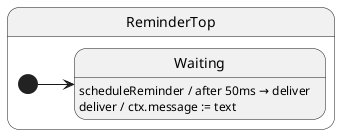

# Tutorial 09: Deferred Post

## Problem

You need to fire an event after a delay without blocking the handler or inventing a “timer” state for every timeout.

## Solution

`deferredPost(millis, event, ...args)` uses `setTimeout`, then enqueues the event like any `post`.

## UML statechart



Time passes on the waiting line; no separate timer state class.

## Walkthrough

Context holds the message once delivery runs:

```typescript
export interface ReminderCtx {
	message: string;
}

export interface ReminderProtocol {
	scheduleReminder(text: string): void;
	deliver(text: string): void;
}
```

The **root state** implements the protocol. `scheduleReminder` returns immediately;
`deferredPost` arms a timer that enqueues `deliver` later:

```typescript
export class ReminderTop extends HsmTopState<ReminderCtx, ReminderProtocol> implements ReminderProtocol {
	scheduleReminder(text: string): void {
		this.deferredPost(50, 'deliver', text); // ← returns immediately; event runs after 50ms
	}

	deliver(text: string): void {
		this.ctx.message = text; // runs when timer fires and mailbox drains
	}
}
```

Mark the **initial state** — a single state is enough when timing is modeled as
a deferred event, not a separate mode:

```typescript
@HsmInitialState
export class Waiting extends ReminderTop {}
```

Wire up the factory:

```typescript
export const reminderFactory = new HsmFactory(ReminderTop);

export function createReminder() {
	return reminderFactory.create({ message: '' });
}
```

From the caller, wait for real time **and** for the mailbox to drain:

```typescript
const sm = createReminder();
await sm.sync();

sm.post('scheduleReminder', 'hello later');
await sleep(100); // timer must fire before deliver is enqueued
await sm.sync();  // deliver handler completes

expect(sm.ctx.message).equals('hello later');
```

`scheduleReminder` finishes before `deliver` runs — same serialized queue as `post`.

## Reading the trace

ihsm logs every dispatch step when `HsmTraceLevel.VERBOSE_DEBUG` is set and a custom `HsmTraceWriter` collects lines. Setup: [Tutorial 02 — Tracing](../02-tracing/README.md).

Each line is **`domain|…|StateName: message`**. Domains nest as the runtime descends: `initialize` → `#eventName` → `execute` → `transition from X to Y`.

```trace
{{TRACE}}
```

**What to notice:** `#scheduleReminder` returns immediately; `#deliver` appears later as its own dispatch after the timer fires.

## Run the test

```shell
npm run test:tutorials -- --grep 'Tutorial 09'
```

## What you learned

- Timers enter the same serialized queue as `post`.
- Handler returns before the deferred event runs.
- No extra state class is required for a simple timeout.

Next: [Tutorial 10 — Call services](../10-call-services/README.md)
