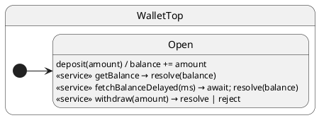

# Tutorial 10: Call Services

## Problem

Sometimes you need a **typed response** from the same actor — not just fire-and-forget events. External mutable state breaks encapsulation.

## Solution

Declare **service methods** with `(resolve, reject, ...)` as first parameters. Use `await sm.call('getBalance')` — a typed Promise through the mailbox.

Every service completes by calling **`resolve(value)`** or **`reject(error)`**. The handler may be **sync** (`void`) or **async** (`Promise<void>`); either way, the caller always uses `await call(...)`.

## UML statechart



Services are events with a reply channel; state stays `Open`.

## Walkthrough

`deposit` is a plain event. The rest are **services** — same Protocol, different completion style:

```typescript
export interface WalletProtocol {
	deposit(amount: number): void;
	getBalance(
		resolve: HsmResolveCallback<number>,
		reject: HsmRejectCallback
	): void;
	fetchBalanceDelayed(
		resolve: HsmResolveCallback<number>,
		reject: HsmRejectCallback,
		delayMs: number
	): Promise<void>;
	withdraw(
		resolve: HsmResolveCallback<number>,
		reject: HsmRejectCallback,
		amount: number
	): void;
}
```

### Sync — resolve / reject before return

Call `resolve` or `reject` directly; no `async`:

```typescript
getBalance(resolve: HsmResolveCallback<number>, _reject: HsmRejectCallback): void {
	resolve(this.ctx.balance);
}

withdraw(resolve: HsmResolveCallback<number>, reject: HsmRejectCallback, amount: number): void {
	if (amount > this.ctx.balance) {
		reject(new Error('insufficient funds'));
		return;
	}
	this.ctx.balance -= amount;
	resolve(this.ctx.balance);
}
```

### Async — Promise handler, then resolve / reject

Return `Promise<void>` (typically `async`). `await` I/O or timers, **then** call `resolve` or `reject`:

```typescript
async fetchBalanceDelayed(
	resolve: HsmResolveCallback<number>,
	_reject: HsmRejectCallback,
	delayMs: number
): Promise<void> {
	await this.sleep(delayMs);
	resolve(this.ctx.balance);
}
```

The runtime `await`s the returned Promise before finishing the dispatch. The caller's `call()` Promise still settles only when you invoke `resolve` or `reject` — not from the handler's return value alone.

### Caller — always `await call(...)`

```typescript
const wallet = createWallet(100);
await wallet.sync();

const balance = await wallet.call('getBalance');           // sync resolve → 100
const later = await wallet.call('fetchBalanceDelayed', 10); // async resolve → 100

try {
	await wallet.call('withdraw', 200);
} catch (error) {
	// reject(new Error(...)) → rejected Promise
}

const remaining = await wallet.call('withdraw', 40);       // sync resolve → 60
```

## Reading the trace

ihsm logs every dispatch step when `HsmTraceLevel.VERBOSE_DEBUG` is set and a custom `HsmTraceWriter` collects lines. Setup: [Tutorial 02 — Tracing](../02-tracing/README.md).

Each line is **`domain|…|StateName: message`**. Domains nest as the runtime descends: `initialize` → `#eventName` → `execute` → `transition from X to Y`.

```trace
{{TRACE}}
```

**What to notice:** `#getBalance` is a service dispatch (same queue as events). Caller `await call(...)` resolves when the handler calls `resolve(...)`.

## Run the test

```shell
npm run test:tutorials -- --grep 'Tutorial 10'
```

## What you learned

- Services: `(resolve, reject, ...payload)` signature; return `void` or `Promise<void>`.
- **Sync:** call `resolve` / `reject` in the handler body.
- **Async:** `async` handler, `await` work, then `resolve` / `reject`.
- `call()` = typed request/response, same queue as `post`.

Next: [Tutorial 11 — Restore](../11-restore/README.md)
