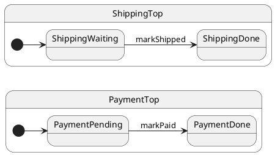

# Tutorial 14: Nested Machines

## Problem

Payment and shipping in one chart couples unrelated concerns — hard to test and evolve independently.

## Solution

Run **separate `Hsm` instances** (orthogonal regions) and coordinate with a small coordinator class.

## UML statechart

Two parallel machines:



The `OrderCoordinator` owns both actors and orchestrates `fulfill()`.

## Walkthrough

Payment region:

```typescript
export class PaymentTop extends HsmTopState<PaymentCtx, PaymentProtocol> implements PaymentProtocol {
	markPaid(): void {
		this.ctx.paid = true;
		this.transition(PaymentDone); // ← payment actor only
	}
}
```

Shipping region — independent queue and cache:

```typescript
export class ShippingTop extends HsmTopState<ShippingCtx, ShippingProtocol> implements ShippingProtocol {
	markShipped(): void {
		this.ctx.shipped = true;
		this.transition(ShippingDone);
	}
}
```

Coordinator composes both:

```typescript
export class OrderCoordinator {
	readonly payment = paymentFactory.create({ paid: false });
	readonly shipping = shippingFactory.create({ shipped: false });

	async fulfill(): Promise<void> {
		this.payment.post('markPaid');
		await this.payment.sync();
		this.shipping.post('markShipped');
		await this.shipping.sync();
	}
}
```

## Reading the trace

ihsm logs every dispatch step when `HsmTraceLevel.VERBOSE_DEBUG` is set and a custom `HsmTraceWriter` collects lines. Setup: [Tutorial 02 — Tracing](../02-tracing/README.md).

Each line is **`domain|…|StateName: message`**. Domains nest as the runtime descends: `initialize` → `#eventName` → `execute` → `transition from X to Y`.

```trace
{{TRACE}}
```

**What to notice:** Each actor has its own trace stream — payment and shipping queues are independent.

## Run the test

```shell
npm run test:tutorials -- --grep 'Tutorial 14'
```

## What you learned

- Orthogonality = multiple machines + composition.
- Each region has its own mailbox.

Next: [Tutorial 15 — Complex workflow](../15-complex-workflow/README.md)
