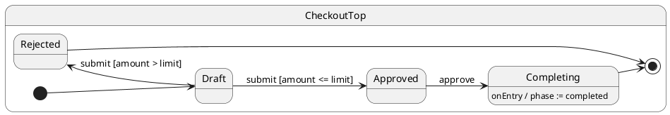

# Tutorial 15: Complex Workflow

## Problem

Production flows combine hierarchy, async validation, guards, services, and multiple outcomes — hard to keep correct with flags alone.

## Solution

Compose features from prior tutorials into one **checkout workflow**: async handlers, inline guards, hierarchy, and `call()`.

## UML statechart



`submit` runs async validation in the handler (not a separate `Validating` state).

## Walkthrough

Context tracks phase and audit trail:

```typescript
export interface CheckoutCtx {
	orderId: string;
	amount: number;
	limit: number;
	phase: OrderPhase;
	validationNotes: string[];
}
```

Async `submit` with inline guard:

```typescript
@HsmInitialState
export class Draft extends CheckoutTop {
	async submit(): Promise<void> {
		this.ctx.phase = 'validating';
		await this.sleep(10);
		this.ctx.validationNotes.push('fraud-check-ok');
		if (this.ctx.amount <= this.ctx.limit) {
			this.transition(Approved); // ← guard in code
		} else {
			this.ctx.phase = 'rejected';
			this.ctx.validationNotes.push('over-limit');
			this.transition(Rejected);
		}
	}
}
```

Approve and complete:

```typescript
export class Approved extends CheckoutTop {
	async approve(): Promise<void> {
		this.ctx.phase = 'approved';
		this.transition(Completing);
	}
}

export class Completing extends CheckoutTop {
	async onEntry(): Promise<void> {
		await this.sleep(10);
		this.ctx.phase = 'completed'; // finalize in entry
	}
}
```

Typed status query:

```typescript
const phase = await order.call('getStatus'); // Promise<OrderPhase>
```

## Reading the trace

ihsm logs every dispatch step when `HsmTraceLevel.VERBOSE_DEBUG` is set and a custom `HsmTraceWriter` collects lines. Setup: [Tutorial 02 — Tracing](../02-tracing/README.md).

Each line is **`domain|…|StateName: message`**. Domains nest as the runtime descends: `initialize` → `#eventName` → `execute` → `transition from X to Y`.

```trace
{{TRACE}}
```

**What to notice:** Async `#submit` handler runs validation inline, then schedules a transition to `Approved` or `Rejected`.

## Run the test

```shell
npm run test:tutorials -- --grep 'Tutorial 15'
```

## What you learned

- Real workflows mix hierarchy, async handlers, guards, and `call`.
- Branching belongs in handlers when it is not a meaningful domain state.

Back to index: [Tutorials](../README.md) · Reference: [REFERENCE.md](../../docs/REFERENCE.md)
