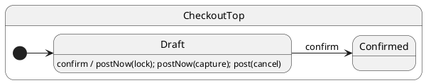

# postNow()

## Problem

During a handler you sometimes need **internal** follow-up events (inventory lock, payment capture, cleanup) to run **before** other work — including normal `post` calls from the same handler or the next mailbox job. That pattern models **extended transitions**: several steps that belong to one logical turn.

## Solution

**`postNow(event, …args)`** enqueues on the **hi-priority** mailbox. After the current handler and its transitions/`then()` chain finish, the runtime drains all hi-priority jobs before normal posts from that handler or the next external `post`.

Only available **inside** handlers (`this.postNow`). The client uses ordinary `post`.

## UML statechart



Internal `lockInventory` and `capturePayment` are not separate states — they are hi-priority events orchestrating the extended `confirm` transition.

## Protocol

```typescript
export interface CheckoutProtocol {
	confirm(): void;
	lockInventory(): void;
	capturePayment(): void;
	cancel(): void;
}
```

---

## Example · Extended transition with guaranteed order

### Handler (state machine)

`confirm` schedules a normal `cancel` (deferred side effect) plus critical steps via `postNow`:

```typescript
confirm(): void {
	this.ctx.steps.push('confirm-start');
	this.post('cancel');                  // normal — runs after postNow steps
	this.postNow('lockInventory');          // hi-priority
	this.postNow('capturePayment');         // hi-priority
	this.ctx.steps.push('confirm-end');
	this.transition(Confirmed);
}
```

`postNow` handlers run **after** `confirm-end` is recorded but **before** `cancel` — still within the same overall `confirm` dispatch cycle.

### Client (caller)

```typescript
const sm = createCheckout();
await sm.sync();

sm.post('confirm');
await sm.sync();
await sm.sync(); // drain postNow follow-ups

expect(sm.ctx.steps).to.deep.equal([
	'confirm-start',
	'confirm-end',
	'lock',
	'capture',
	'cancel',
]);
expect(sm.ctx.committed).equals(true);
```

| Step | What happens |
| ---- | ------------ |
| 1 | `#confirm` handler body runs through `confirm-end` |
| 2 | Transition to `Confirmed` (if any exit/entry/`then`) |
| 3 | Hi-priority `#lockInventory`, `#capturePayment` |
| 4 | Normal `#cancel` from the same handler |

Compare with [Post & sync](../08-post-and-sync/README.md): plain `this.post` from a handler is FIFO **after** the handler returns — `postNow` cuts ahead of those normal posts.

---

## vs `then()`

| | `postNow('event')` | `then()` |
| --- | --- | --- |
| Mechanism | Protocol event on hi-priority queue | Lifecycle hook on state class |
| Reusable handlers | Yes — shared events | No — per-state override |
| Client can trigger | Yes — `post('event')` | No |

Use **`postNow`** to reuse existing protocol handlers as internal orchestration steps. Use **`then()`** for choice pseudo states ([then()](../16-then/README.md)).

---

## Reading the trace

With `HsmTraceLevel.VERBOSE_DEBUG` and a custom `HsmTraceWriter`, ihsm logs each dispatch step. Trace line format is covered in [Tracing](../02-tracing/README.md).

```trace
{{TRACE}}
```

**What to notice:** `#lockInventory` and `#capturePayment` appear after `#confirm` completes its handler body but before `#cancel`.

## Verify

```shell
npm run test:tutorials -- --grep 'Tutorial 17'
```
