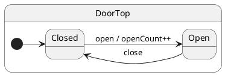

import InteractiveTutorial from '@site/src/components/InteractiveTutorial';
import { interactive } from '@tutorials/01-hello-state-machine/interactive';

# 01 · Hello state machine

## Problem

A plain class with boolean flags (`isOpen`, `isClosed`) mixes **mode** and **behavior**. Every method must re-validate flags, and invalid combinations compile without error.

## Solution

Model each mode as a **state class**. Events are methods; crossing a mode boundary calls `this.transition(NextState)`.

## UML statechart



We declare what the machine remembers (`DoorCtx`) and which events exist (`DoorProtocol`). The protocol drives typed `post('open')` at compile time.

```typescript
export interface DoorCtx {
	openCount: number;
}

export interface DoorProtocol {
	open(): void;
	close(): void;
}
```

The **root state** inherits mailbox machinery from `HsmTopState`. It anchors the hierarchy; behavior lives in substates.

```typescript
export class DoorTop extends HsmTopState<DoorCtx, DoorProtocol> {}
```

Mark the **initial state** with `@HsmInitialState`. After `makeHsm`, the runtime descends here.

### Handler — `Closed` state

```typescript
@HsmInitialState
export class Closed extends DoorTop {
	open(): void {
		this.ctx.openCount += 1;
		this.transition(Open);
	}
}
```

### Handler — `Open` state

```typescript
export class Open extends DoorTop {
	close(): void {
		this.transition(Closed);
	}
}
```

### Client — create actor, `post`, `sync`

Create the machine with `makeHsm` (or the tutorial helper `createDoor()`):

```typescript
import { makeHsm } from 'ihsm';

const door = makeHsm(DoorTop, { openCount: 0 });
await door.sync();           // wait for init (onEntry chain + then() if defined)
```

The client never calls `open()` directly — it enqueues the event by name:

```typescript
door.post('open');           // fire-and-forget — enqueues open handler
await door.sync();           // wait until open handler + transition complete

door.post('close');
await door.sync();           // same pattern for the next event
```

Each **`post` + `sync`** pair is similar to a single **`await call(...)`**: the client waits until one enqueued dispatch finishes (handler + transition). The difference is that `post` has no typed return value — use `call` when you need a reply in the same step ([Call services](/tutorials/10-call-services)).

To wait until **several** posts have been processed, enqueue them all first, then **`sync` once**:

```typescript
door.post('open');
door.post('close');
await door.sync();           // drain the whole batch before continuing
```

See [Post and sync](/tutorials/08-post-and-sync) for handler-side chaining and ordering rules.

| Side | Code | Waits? |
| ---- | ---- | ------ |
| Handler | `open(): void { … }` on `Closed` | Runtime runs it when dispatched |
| Client | `door.post('open')` | No — returns immediately |
| Client | `await door.sync()` | Yes — drain queue through handler + transition |

## Reading the trace

<InteractiveTutorial meta={interactive} />


With `HsmTraceLevel.VERBOSE_DEBUG` and a custom `HsmTraceWriter`, ihsm logs each dispatch step. Trace line format is covered in [Tracing](/tutorials/02-tracing).

Each line is **`domain|…|StateName: message`**. Domains nest as the runtime descends: `initialize` → `#eventName` → `execute` → `transition from X to Y`.


**What to notice:** `initialize` descends to `Closed`. Each `post` opens a `#open` / `#close` domain. After the handler, `requested transition` and `started transition` show the LCA path; `final state is` confirms the new leaf.

## Verify

```shell
npm run test:tutorials -- --grep 'Tutorial 01'
```
