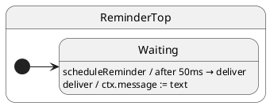

import InteractiveTutorial from '@site/src/components/InteractiveTutorial';
import { interactive } from '@tutorials/09-deferred-post/interactive';

# 09 · deferredPost

## Problem

You need to fire an event after a delay without blocking the handler or inventing a “timer” state for every timeout.

## Solution

`deferredPost(millis, event, ...args)` uses `setTimeout`, then enqueues the event like any `post`. ## UML statechart



## Protocol

```typescript
export interface ReminderProtocol {
	scheduleReminder(text: string): void;
	deliver(text: string): void;
}
```

---

## Example · Schedule from handler, wait from client

### Handler (state machine)

`scheduleReminder` returns immediately; the timer enqueues `deliver` later:

```typescript
export class ReminderTop extends HsmTopState<ReminderCtx, ReminderProtocol> implements ReminderProtocol {
	scheduleReminder(text: string): void {
		this.deferredPost(50, 'deliver', text); // arms timer → post('deliver', text)
	}

	deliver(text: string): void {
		this.ctx.message = text;
	}
}

@HsmInitialState
export class Waiting extends ReminderTop {}
```

Inside a handler you can also chain: `this.deferredPost(ms, 'event', …)` — same mailbox rules as `this.post`.

### Client (caller)

Wait for **real time** (timer must fire) **and** mailbox drain:

```typescript
const sm = createReminder();
await sm.sync(); // init

sm.post('scheduleReminder', 'hello later'); // handler returns immediately
await sleep(100);                           // timer fires → deliver enqueued
await sm.sync();                            // deliver handler completes

expect(sm.ctx.message).equals('hello later');
```

| Step | Who | What happens |
| ---- | --- | ------------ |
| 1 | Client | `post('scheduleReminder', …)` enqueues handler |
| 2 | Handler | `deferredPost(50, 'deliver', …)` — returns; timer armed |
| 3 | Client | `await sync()` — `scheduleReminder` done |
| 4 | Timer | After 50ms, `deliver` enters mailbox |
| 5 | Client | `await sync()` — `deliver` handler runs |

`deferredPost` is only available **inside** handlers (`this.deferredPost`). The client uses ordinary `post` to trigger the scheduling handler.

---

## Reading the trace

<InteractiveTutorial meta={interactive} />


With `HsmTraceLevel.VERBOSE_DEBUG` and a custom `HsmTraceWriter`, ihsm logs each dispatch step. Trace line format is covered in [Tracing](/tutorials/02-tracing).

Each line is **`domain|…|StateName: message`**. Domains nest as the runtime descends: `initialize` → `#eventName` → `execute` → `transition from X to Y`.


**What to notice:** `#scheduleReminder` returns immediately; `#deliver` appears later as its own dispatch after the timer fires.

## Verify

```shell
npm run test:tutorials -- --grep 'Tutorial 09'
```
