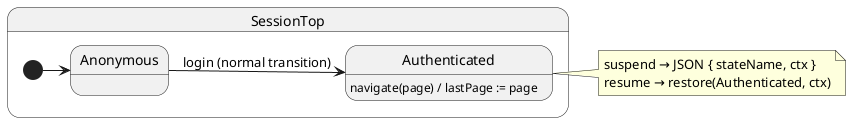

import InteractiveTutorial from '@site/src/components/InteractiveTutorial';
import { interactive } from '@tutorials/11-restore/interactive';

# 11 · restore

## Problem

After restart or loading from a database, you must resume at a specific mode with specific data — without replaying every event.

## Solution

1. **Suspend** — read `currentState` + `ctx`, serialize to JSON (DB row or file).
2. **Resume** — `makeHsm(..., false)` on a **new** instance, then `restore(stateClass, ctx)`.

`restore` sets active state and context **without** running `onEntry` or `onExit`.

## UML statechart



`suspend` / `resume` are **meta-operations** (not Protocol events) — persistence boundaries.

States and a name registry (classes cannot be JSON-serialized):

```typescript
export const SESSION_STATES = {
	Anonymous,
	Authenticated,
} as const;

export type SessionStateName = keyof typeof SESSION_STATES;

export interface PersistedSession {
	stateName: SessionStateName;
	ctx: SessionCtx;
}
```

### 1. Run a live session

```typescript
const live = createSession('user-42');
await live.sync(); // onEntry: Anonymous

live.restore(Authenticated, {
	userId: 'user-42',
	lastPage: 'settings',
	entryLog: live.ctx.entryLog,
});
live.post('navigate', 'billing');
await live.sync();
```

### 2. Suspend to disk / DB

Serialize **state name + ctx** — not the class reference:

```typescript
export function suspendSession(sm: Hsm<SessionCtx, SessionProtocol>): string {
	return JSON.stringify({
		stateName: stateNameOf(sm), // 'Authenticated'
		ctx: { ...sm.ctx },
	} satisfies PersistedSession);
}

// DB column or file write
sessionDb.set(sessionId, suspendSession(live));
```

### 3. New process — instantiate and restore

Skip initialization (`initialize: false`), then jump to the saved leaf:

```typescript
export function resumeSession(json: string) {
	const { stateName, ctx } = JSON.parse(json) as PersistedSession;
	const sm = sessionFactory.create(
		{ userId: '', lastPage: '', entryLog: [] },
		false // ← no onEntry descent
	);
	sm.restore(SESSION_STATES[stateName], ctx);
	return sm;
}

const afterRestart = resumeSessionFromDb('sess-7');
await afterRestart.sync();
// Authenticated, lastPage === 'dashboard', no fresh onEntry
```

### 4. Continue from the snapshot

```typescript
afterRestart.post('navigate', 'profile');
await afterRestart.sync();
```

`entryLog` shows the difference: init recorded `Anonymous` once; restore did **not** append `Authenticated`.

## Reading the trace

<InteractiveTutorial meta={interactive} />


With `HsmTraceLevel.VERBOSE_DEBUG` and a custom `HsmTraceWriter`, ihsm logs each dispatch step. Trace line format is covered in [Tracing](/tutorials/02-tracing).

Each line is **`domain|…|StateName: message`**. Domains nest as the runtime descends: `initialize` → `#eventName` → `execute` → `transition from X to Y`.


**What to notice:** `restore()` does **not** emit trace — it is a meta-operation. After rehydration, `#navigate` behaves like any normal event dispatch.

## Verify

```shell
npm run test:tutorials -- --grep 'Tutorial 11'
```
