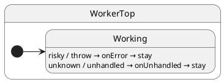

import InteractiveTutorial from '@site/src/components/InteractiveTutorial';
import { interactive } from '@tutorials/12-error-recovery/interactive';

# 12 · Error recovery

## Problem

Handlers throw; events arrive in the wrong state. Uncaught errors leave the actor in an undefined condition.

## Solution

Override **`onError`** (handler threw) and **`onUnhandled`** (no handler). Recover by logging, updating ctx, or transitioning.

## UML statechart



Recovery keeps the machine in `Working` when hooks swallow the failure.

`risky` simulates a fault; `unknown` triggers unhandled:

```typescript
export class WorkerTop extends HsmTopState<WorkerCtx, WorkerProtocol> implements WorkerProtocol {
	risky(): void {
		throw new Error('simulated failure');
	}
	unknown(): void {
		this.unhandled(); // ← routes to onUnhandled
	}
}
```

`Working` recovers without leaving:

```typescript
@HsmInitialState
export class Working extends WorkerTop {
	onError<EventName extends keyof WorkerProtocol>(
		_error: HsmEventHandlerError<WorkerCtx, WorkerProtocol, EventName>
	): void {
		this.ctx.recovered += 1; // ← swallow, stay in Working
		this.ctx.failures += 1;
	}

	onUnhandled<EventName extends keyof WorkerProtocol>(
		_error: HsmUnhandledEventError<WorkerCtx, WorkerProtocol, EventName>
	): void {
		this.ctx.failures += 1;
	}
}
```

```typescript
worker.post('risky');
await worker.sync();
// still Working, recovered === 1
```

## Reading the trace

<InteractiveTutorial meta={interactive} />


With `HsmTraceLevel.VERBOSE_DEBUG` and a custom `HsmTraceWriter`, ihsm logs each dispatch step. Trace line format is covered in [Tracing](/tutorials/02-tracing).

Each line is **`domain|…|StateName: message`**. Domains nest as the runtime descends: `initialize` → `#eventName` → `execute` → `transition from X to Y`.


**What to notice:** `#risky` throws → `error recovery` domain → `onError` → machine stays in `Working` when recovery succeeds.

## Verify

```shell
npm run test:tutorials -- --grep 'Tutorial 12'
```
