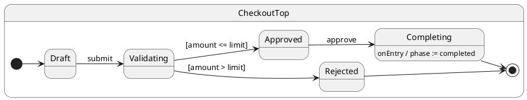

import InteractiveTutorial from '@site/src/components/InteractiveTutorial';
import { interactive } from '@tutorials/15-complex-workflow/interactive';

# 15 · Complex workflow

## Problem

Production flows combine hierarchy, async validation, guards, services, and multiple outcomes — hard to keep correct with flags alone.

## Solution

Compose hierarchy, async validation, a **`then()`** decision pseudo state, and `call()` in one **checkout workflow**. See [then()](/tutorials/16-then) for the choice pattern in isolation.

## UML statechart



`submit` runs async validation, then enters `Validating`. The guard runs in **`then()`** — not inline in the handler.

Context tracks phase and audit trail:

```typescript
export interface CheckoutCtx {
	orderId: string;
	amount: number;
	limit: number;
	phase: OrderPhase;
	validationNotes: string[];
}
```

Async `submit` hands off to the decision state:

```typescript
@HsmInitialState
export class Draft extends CheckoutTop {
	async submit(): Promise<void> {
		this.ctx.phase = 'validating';
		await this.sleep(10);
		this.ctx.validationNotes.push('fraud-check-ok');
		this.transition(Validating);
	}
}
```

Decision pseudo state — guard in `then()`:

```typescript
export class Validating extends CheckoutTop {
	then(): void {
		if (this.ctx.amount <= this.ctx.limit) {
			this.transition(Approved);
		} else {
			this.ctx.phase = 'rejected';
			this.ctx.validationNotes.push('over-limit');
			this.transition(Rejected);
		}
	}
}
```

Approve and complete:

```typescript
export class Approved extends CheckoutTop {
	async approve(): Promise<void> {
		this.ctx.phase = 'approved';
		this.transition(Completing);
	}
}

export class Completing extends CheckoutTop {
	async onEntry(): Promise<void> {
		await this.sleep(10);
		this.ctx.phase = 'completed'; // finalize in entry
	}
}
```

Typed status query:

```typescript
const phase = await order.call('getStatus'); // Promise<OrderPhase>
```

For extended transitions that must run internal events before other mailbox work, see [postNow()](/tutorials/17-post-now).

## Reading the trace

<InteractiveTutorial meta={interactive} />


With `HsmTraceLevel.VERBOSE_DEBUG` and a custom `HsmTraceWriter`, ihsm logs each dispatch step. Trace line format is covered in [Tracing](/tutorials/02-tracing).

Each line is **`domain|…|StateName: message`**. Domains nest as the runtime descends: `initialize` → `#eventName` → `execute` → `transition from X to Y` → `then`.


**What to notice:** Async `#submit` finishes validation, enters `Validating`, then `Validating.then()` schedules the transition to `Approved` or `Rejected` in the same dispatch.

## Verify

```shell
npm run test:tutorials -- --grep 'Tutorial 15'
```
