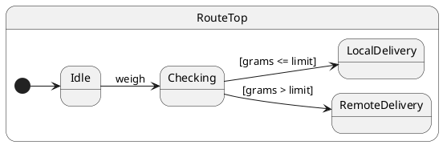

import InteractiveTutorial from '@site/src/components/InteractiveTutorial';
import { interactive } from '@tutorials/16-then/interactive';

# 16 · then()

## Problem

UML **choice** (decision) pseudo states branch immediately after entry — no external event triggers the guard. Putting guards inside every handler duplicates structure and hides the decision point.

## Solution

Override **`then()`** on a **leaf** state. The runtime calls it automatically after initialization or after a handler finishes (including any `transition()` exit/entry chain). Use it to evaluate guards and call `transition()` — same dispatch turn, no extra `post`.

`then()` is not part of `Protocol`; clients cannot `post('then')`.

## UML statechart



`Checking` has no incoming protocol event for the branch — **`then()`** implements the choice.

## Protocol

```typescript
export interface RouteProtocol {
	weigh(grams: number): void;
}
```

---

## Example · Decision pseudo state

### Handler (state machine)

`weigh` records the measurement and enters `Checking`. The branch runs in `then()`:

```typescript
export class RouteTop extends HsmTopState<RouteCtx, RouteProtocol> implements RouteProtocol {
	weigh(grams: number): void {
		this.ctx.grams = grams;
		this.ctx.audit.push('weighed');
		this.transition(Checking);
	}
}

export class Checking extends RouteTop {
	then(): void {
		this.ctx.audit.push('decide');
		if (this.ctx.grams <= this.ctx.localLimitGrams) {
			this.transition(LocalDelivery);
		} else {
			this.transition(RemoteDelivery);
		}
	}
}
```

Define `then()` only on the leaf that owns the decision — the empty default on `HsmTopState` is **not** inherited by subclasses.

### Client (caller)

One `post`, one `sync` — the choice and target `onEntry` complete in the same dispatch:

```typescript
const sm = createRouter(500);
await sm.sync();

sm.post('weigh', 200);
await sm.sync();

expect(sm.ctx.route).equals('local');
expect(sm.currentState).equals(LocalDelivery);
```

| Step | What happens |
| ---- | ------------ |
| 1 | `#weigh` handler runs, `transition(Checking)` |
| 2 | Exit/entry for `Checking` |
| 3 | `Checking.then()` evaluates guard, `transition(LocalDelivery)` |
| 4 | `LocalDelivery.onEntry()` sets `route` |

### Chaining

If `then()` calls `transition(Next)` and `Next` also defines `then()`, the runtime chains steps (up to 32 per init/dispatch). Useful for multi-step boot or pipeline pseudo states.

---

## vs `post()` from `onEntry`

| | `then()` | `post()` from `onEntry` |
| --- | --- | --- |
| Same dispatch turn | Yes | No — separate mailbox job |
| After init | Yes (on initial leaf) | Only if you `post` in `onEntry` |
| Typed as protocol event | No | Yes |

Use **`then()`** for choice/junction pseudo states. Use **`post()`** when the follow-up should be a separate, externally visible event ([Post & sync](/tutorials/08-post-and-sync)).

See also [Complex workflow](/tutorials/15-complex-workflow) for `then()` after async validation.

---

## Reading the trace

<InteractiveTutorial meta={interactive} />


With `HsmTraceLevel.VERBOSE_DEBUG` and a custom `HsmTraceWriter`, ihsm logs each dispatch step. Trace line format is covered in [Tracing](/tutorials/02-tracing).

Each line is **`domain|…|StateName: message`**. Look for the `then` domain after the `#weigh` handler completes.


**What to notice:** `Checking.then()` runs in the same `#weigh` dispatch, before the trace records `end event dispatch`.

## Verify

```shell
npm run test:tutorials -- --grep 'Tutorial 16'
```
